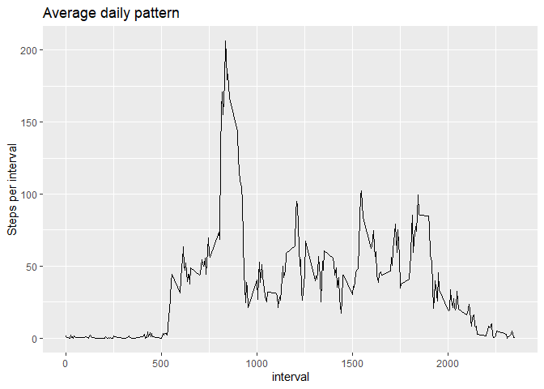
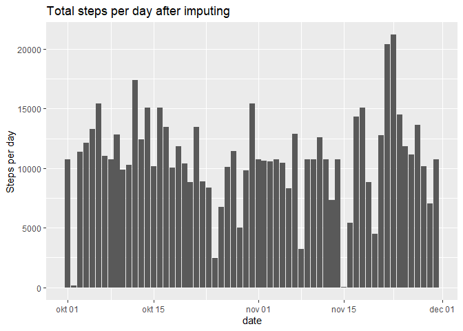
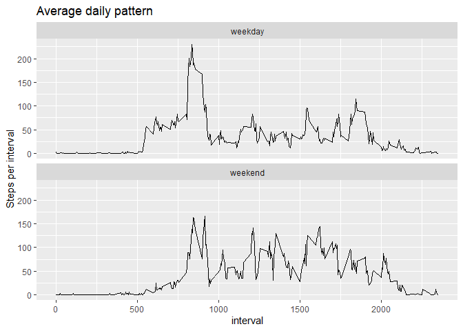

## Loading and preprocessing the data


```r
data <- read.csv("activity.csv", header = T, colClasses =  c("numeric","Date","numeric"))
```


## What is mean total number of steps taken per day?

### This is a histogram of the total number of steps taken each day

```r
        sum <- aggregate(data$steps,by = list(date = data$date), sum)
        colnames(sum)[2] <- "steps"
        
library(ggplot2)
        g <- ggplot(sum, aes(x= date, y = steps))
        g + geom_bar(stat = 'identity', na.rm = T) +
           ggtitle("Total steps per day") +
           ylab("Steps per day")
```

```
## Warning: Removed 8 rows containing missing values (position_stack).
```

<!-- -->

### The mean of the steps per day is 

```r
        mean(sum$steps, na.rm = T)
```

```
## [1] 10766.19
```
### The median of the steps per day is

```r
        median(sum$steps, na.rm = T)
```

```
## [1] 10765
```


## What is the average daily activity pattern?
### Time series plot of the average steps per interval

```r
 interval <- aggregate(data$steps,by = list(interval= data$interval),                 mean , na.rm = T)
        colnames(interval)[2] <- "steps"
        
        library(ggplot2)
        g <- ggplot(interval,aes(x= interval, y = steps))
        g + geom_line() + ggtitle("Average daily pattern") +
           ylab("Steps per interval")
```

<!-- -->

### The interval with the maximum number of steps is

```r
interval[which.max(interval$steps),1]
```

```
## [1] 835
```

## Imputing missing values
### Number of missing cases are

```r
nrow(data[!complete.cases(data),])
```

```
## [1] 2304
```
### Strategy for imputing
We will fill in the missing data for each interval with the mean for that interval across the dataset and create a new dataset 'impute'

```r
impute <- merge(data, interval, by = c("interval"), sort = F)
impute$steps.x <- ifelse(is.na(impute$steps.x), impute$steps.y, impute$steps.x)
impute <- impute[order(impute$date),]
impute <- impute[,-4]
colnames(impute)[2] <- "steps"
```
### Create a histogram of the total number of steps  each day.

```r
        sumimpute <- aggregate(impute$steps,by = list(date = impute$date),                       sum)
        colnames(sumimpute)[2] <- "steps"
        
library(ggplot2)
        g <- ggplot(sumimpute,aes(x= date, y = steps))
        g + geom_bar(stat = 'identity') +
           ggtitle("Total steps per day after imputing") +
           ylab("Steps per day")
```

<!-- -->

### The mean of the steps per day after imputing is 

```r
        mean(sumimpute$steps)
```

```
## [1] 10766.19
```

### The median of the steps per day after imputing is

```r
        median(sumimpute$steps)
```

```
## [1] 10766.19
```
### Do the new values of mean and median differ from the estimates from the first part? What is the impact of imputing missing data on the estimates of the total daily number of steps?

No impact on the two means since we imputed with average values for each interval. The new median is slightly higher than the old. By replacing the NAs we now have a bit more observations than before, thus the 'middle one' also changed. 

## Are there differences in activity patterns between weekdays and weekends?

```r
impute$day <- weekdays(impute$date)
impute$daynumber <- as.POSIXlt(impute$date)$wday
impute$weekend <- ifelse(impute$daynumber > 0 & impute$daynumber < 6, "weekday", "weekend")
impute$weekend <- as.factor(impute$weekend)

intervalimpute <- aggregate(impute$steps,by = list(interval= impute$interval, weekend                   = impute$weekend),    mean)
colnames(intervalimpute)[3] <- "steps"
        
        library(ggplot2)
        g <- ggplot(intervalimpute,aes(x= interval, y = steps))
        g + geom_line() + facet_wrap(.~ weekend, nrow = 2 ) +
                ggtitle("Average daily pattern") +
           ylab("Steps per interval")
```

<!-- -->


